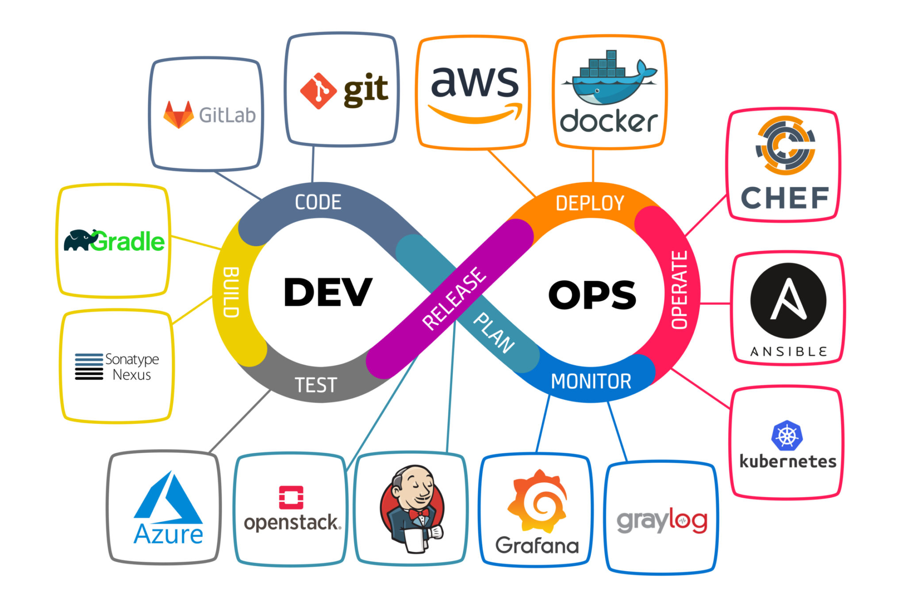
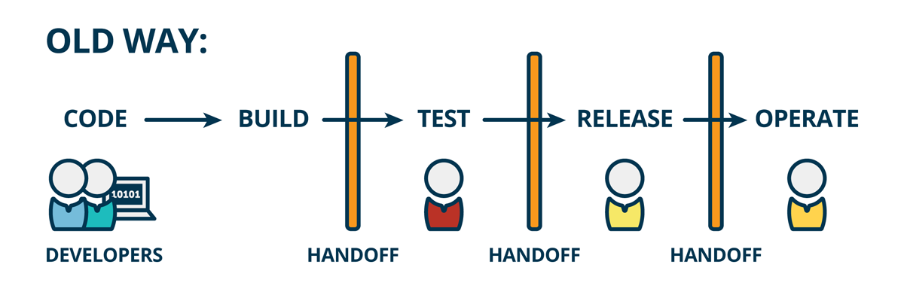
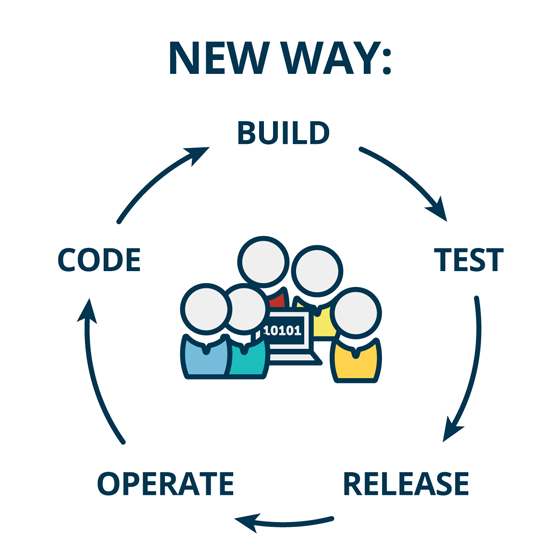

# DEVOPS
## Introduction to DevOps





__UNDERSTAND THE BASICS__

Focus on the three key areas:

- infrastructure

- automation

- monitoring


__START WITH LINUX__

- File systems

- permissions

- shell scripting

- basic commands


__LEARN NETWORKING__

Understanding networking is crucialfor deploying and troubleshooting applications.

__LEARN:__

- DNS

- TCP/IP PROTOCOLS

- PORTS

- GATEWAYS

- ROUTING

- SUBNETTING

__EXPLORE VIRTUALIZATION AND OPERATING SYSTEMS__

Install tools like vmware, virtual box or vagrant to create virtual machines. configure linux on these virtual machines to understand resource distribution and operating system management.

__MASTER PROGRAMMING AND GIT__

Gain knowledge of Git for:

- version control

- cloning repositories

- creating branches

- submitting pull request

__DIVE INTO CLOUD COMPUTING__

Choose a top cloud provider like:

- Azure

- AWS

- GCP

focus on core services like:

EC2, S3, RDS, VPC, etc..

Embrace infrastructure as code (IAC): learn YAML or JSON and start with terraform to automate infrastructure provisioning.


## WHAT IS DEVOPS

DevOps is a set of practices and cultural principles that aim to bridge the gap between software developers and IT operations team. It promotes collaboration and communication between them.


DevOps bridges the gap between developers and IT operations team bringing them together to improve software delivery.


DevOps is a blend of two terms: development and operations. Traditionally, both of these departments were isolated and this often creates problems. For example, it could take longer to release software or provide for effective testing.


__THE CONCEPTS__ (SOFTWARE DEVELOPMENT LIFECYLE- SDLC)

Software development lifecyle is a very well defined and organized process.

- __1st phase__ (REQUIREMENT- Gathering and analysis) : product features, users, usage, user requirement, market state.

- __2nd phase__ (PLANNING- what do you want?) : it determines the cost and resource required for implementation of the product and also the risks associated with it. Plan the type of APP needed to be developed.

- __3rd phase__ (DESIGNING- Architectures) : Architects will design the software based on the inputs from previous phase. Architects will produce design documents. 

- __4th phase__ (DEVELOPMENT- Developers) : This is where the developers will invite the software codes based on the design. Building the APP.


- __5th phase__ (TESTING- Quality Assurance) : In this phase the software will be tested by software testers for any defects and rebuild if necessary.


- __6th phase__ (DEPLOYMENT- System Admins) : Software is deployed to the production environment so users can start using the product. Its the work of the system Admins and operations to make sure software is up and running all the time. Presenting the APP.

- __final phase__ (MAINTENANCE- Changes and uptime) : It is the balance between regular changes and uptime. Watching the APP, if there are changes to be made.


The entire process is called __software development lifecycle- SDLC__

__MODELS IN SDLC__

There are different types of model in SDLC 

- Waterfall model

- Agile model


__WATERFALL MODEL__ : Each phase must be completed before the next phase can begin (the next phase is sterted only after the previous phase is completed). It's very difficult here to go back and change someting that was not well mapped out in the planning. It cannot accomodate changing requirement. The working software is produced very late in the lifecycle, it may take months.

__AGILE MODEL__ : Each iteration could be two to four weeks. it will be divided into smaller lists and work on the the lists for two to four weeks and move on to the next lists and so on. But at times the software testers are not able to access the servers or their test cases are failing. It will put extra stress on the team, there will be regular code changes. OPs team need to maintain system uptime all the time and you can pass the deadline. It addresses gaps and conflicts between the the customer and developers.








Now thats when __DevOps__ comes into the picture.

- __Dev- Development__

- __Ops- Operations__


__WHAT IS CONTINOUS INTEGRATION__ : This is an automated process in Devops which generate software and its features quickly and effecively.

Developers write several lines of code while creating a software.

Working in a team is an ideal practice to store all this code at a centralized place. This centralized repository is called a _version control system_ like __GITHUB__.

Everyday developers will pull and push code several times in a day. So code changes or code commit happens continously.

And the code will be moved to build server on build servers. the code will be built, tested and evaluated which generates the software or we call __artifact__

This artifact or software will be stored in a software repository.

Artifact or software is really an archive of files generated from the build process based on the programming language. It will packaged in a specific format. 

- Artifact packaging format could be WAR or JAR in java

- DDL/EXE/MSI in windows or even ZIP/TAR 

From repository it will be shipped to servers for further testing. After deploying this artifact on the servers, software testers can conduct further testing and once they approve , it can be shipped to production servers.

__PROBLEMS__

  These developers are creating a software model and have worked for 3 weeks straight (thats alot of code) and all the code will be fetched by the build server, and this code is build tested and lots of errors, bugs, conflicts and build failure etc. Now developers have to fix all these defects, have to rewrite the code at several places, lots of reworks. so the code is getting merged into the repository but not really getting integrated.

  __SOLUTIONS__

  The solution to this is a very simple and a continuous process after every single commit from the developers, the code should be built and tested, so no waiting and collecting all these codes with bugs but then developers commits several times in a day. So its not humanly possible to do a build and release, So when the developers commits anycode and automated process, will fetch the code, build it tested and send a notification if there is any failure. As soon as the developers receives a failed notification, he or she will fix the code and commit it again. So again, build and test new changes, if its good then it can be versioned and stored in a software repository and its all automated.

  The entire process is called continuous integration __CI__.

  The goal of CI is to detect defects at a very early stage so it does not multiply.


__CONTNUOUS DELIVERY__: Is an automated process of delivering code changes to servers quickly and efficiently at an enormous (huge) phase. 

Continuous delivery is the extension of continous integration.

We have to understand that in agile development there will be regular code changes which needs to be deployed on serevers for further testing.

Deployment is not just about shipping the software to the servers, its more than that.

A deployment could also mean server provisioning, installing dependencies on servers, configuration changes, network or firewall rules changes and then deploy the artifacts to the server and there could be many more things.

After the manual deployment, information will be sent to the QA team for testing after conducting testing, QA team will send information back. There's too much of human intervention and manual approval in this process.

__SOLUTION__

Any and every step in deploment should be automated.

There are a lot of automation tools available in the market, like Ansible, puppet, chef for system automation, terraform confirmation for cloud infrastructure, automation, jenkins etc

Software testing also has to be automated. Any test process like functional, load, performance, database, network and security.

So OPs team will write automation code for deployment, testers will write automation code for software testing and sync it with developers source code.

continuous delivery automate every step and then stitch everything together.

__CONTINUOUS DEIVERY__ is a software development practice where code changes are automatically prepared for a release to production.

__CONTINUOUS INTEGRATION__ is a devops software development practice where developers regularly merge their code changes into central repository after which automated builds and tests are run.

__CONTINUOUS DEPLOYMENT__ is a software development practices where code changes are automatically deployed to production environment without manual intervention.


__LINUX__

In linux everything is a file (including the hardware, mouse, keyboard, printer) are all considered as a file by linux operating system

We avoid captive user interface in linux that means we dont like graphical software.

configuration data are stored in text file

NB: if you want to run servers, prefer Red hat operating system. if you want to use it for DevOps for some automation purpose use ubuntu.

RPM based= RHEL, centos, oracle linux

Debian based= ubuntu server, kali linux

In VIM EDITOR 

- to set number `:se nu`

- to go back to the last line `shift G`

- to go back to the first line `shift gg`

- to delete `dd`

- to undo `u`

- to delete multiple lines eg first 5 lines `5dd`

- to search some content use slash `/fish` and hit enter then `n` to go to the next search.

There are 3 modes in vim editor

- command mode (normal mode)

- insert mode

- extended mode (visual mode)


-rw --- --- (hypen means its a regular file,regular file could mean its a text file or it could mean its a binary file).

crw --- --- (means character file)
 
brw --- --- (means block file)

lrw --- --- (link shortcut and point to original)

srw --- --- (socket file, it provides inter process networking protected by the file system)

prw --- --- (pipe file, it allows processes to communicate with each other without using network socket semantics)


How to create a soft link 

Creating a soft link (or symbolic link) allows you to create a reference to a file or directory in a different location. Here’s how to do it in various operating systems:

On Linux and macOS
You can create a soft link using the ln command with the -s option.

Syntax:
```
ln -s [target_file_or_directory] [link_name]

```

Example: To create a symbolic link named `mylink` pointing to a file called `myfile.txt`:

```
ln -s /path/to/myfile.txt /path/to/mylink

```


__GREP__

grep firewall anaconda-ks.cfg (look for firewall in the anaconda-ks.cfg)

to ingnore the case sensitivity, you use -i in grep (grep -i firewall anaconda-ks.cfg) it will show you all the content or the lines that contains the word firewall.

__INPUT REDIRECTION SYMBOL__

`grep -i firewall < anaconda-ks.cfg`

anaconda file is coming as input for grep -i firewall

for multiple file

`grep -i firewall *` it will list all the files containing the firewall in anaconda-ks.cfg.

if you dont know where a word is in a file `use -R` `grep -R SElinux /etc/*`

if you dont want to see anything that contain firewall in a file. `use -vi` and it will ommit the word firewall `grep -vi firewall anaconda-ks.cfg` 


__HEAD__

to see the first few lines of a file `head anaconda-ks.cfg` then to see first 20 lines `head -20 anaconda-ks.cfg`

__TAIL__

to see the last 10 lines of a file `tail anaconda-ks.cfg` 

__cat /etc/password__

This file contains user information , all the the users in our information and their information.


__TO REPLACE A WORD IN VIM EDITOR__


Enter normal mode (press `Esc` if you're not already in it).

Type `:`. This enters command mode.

Type `s/<old_word>/<new_word>/` (replace `<old_word>` with the word you want to replace and `<new_word>` with the replacement word).

Flags (Optional):

`g`: Replace all occurrences of the word in the current line (default is only the first).

`i`: Case-insensitive search (replace regardless of uppercase/lowercase).

`c`: Confirm before each replacement (prompts you to replace or skip).

Press `Enter`. Vim will execute the substitution command based on the options you provided.


eg: `:%s/coronavirus/covid19` but if the word appears more than one in a line only one will change

to change it everywhere add g `:%s/coronavirus/covid19/g` g means global


__to replace with nothing__

`:%s/covid19//g` it means the word covid19 will be removed


__REDIRECTION__

Is aprocess where we can copy the output of any commands, files into a new file. There are 2 ays of redirecting the output into a file using > or >> filename after the command.

If you dont want to print it on the screen you do this

`uptime > /tmp/sysinfo.txt` you redirected the uptime to sysinfo file inside tmp folder. In redirection if the file doesn't exit it will create the file.

`<<` is used for input redirection, while `>>` is used for output redirection, typically appending output to a file.

__REDIRECTION OUTPUT__


`>` and `>>` are redirection operators used to control where the output of a command or program is sent. 


`>` (__single greater than__)

- The `>` operator is used for output redirection.

- it redirects the standard outputs (stdout) of a command to a file

- If the file specified after `>` already exists, it will be overwritten.

- if the file does not exist, it will be created.

__EXAMPLE__

`echo "Hello World!" > output.txt`

this command will write the text "Hello World!" to a file named 'output.txt', overwriting its content if the file already exists.


`>>` (__double greater than__)

- it appends the standard output (stdout) of a command to a file

- if the file specified after `>>` already exists, the output will be appended to the end of a file.

- if the file does not exist, it will be created.

__EXAMPLE__

 `echo "Additional content" >> output.txt`

 This command will append the text "Additional content" to the end of the file "output.txt"

 NB: To append content to a file means adding or attaching new information, data or material to the existing content of a file, document, database or any other storage medium.

 __file handling__: if you append content to a file, you are adding new text or data to the end of the existing content in that file without over writing or erasing the original content.

 __over writing__: is the process of replacing or updating the content of an existing file with new data. when you over write a file, the original content is replaced entirely by the new content.

 

 `<<` is also known as here document. it is used to redirect input from a specified delimiter (often used for providing input to commands) `cat << EOF`

 `>>` is used for output redirection and is commonly used to append output to the end of a file. if the file doesn't exist, it will be created e.g `echo "this text will be appended to the file" >> file.txt`


 But if you dont want to see output, not on the screen not in any file, then you can redirect the output to somewhere else , which is the /dev/null. this is a file that does not contain anything, if you throw anything in the file , its gone. its like a __black hole__ in galaxy.


Output redirection 2 means standard error, and if you want to redirect any kind of output, whether its error you just put `&` and it will display.

Example: `freee -m &>> /tmp//error.log` &>> is to redirect and append all the output to file (output and error both)


__REVERSE PROXY__ is like a friendly middleman for website and the internet.(imagine you want to visit a website, lets call it "Awesomewebsite.com" instead of giving directly to Awesomewebsite.com you go to the reverse proxy first.)


We have three kind of user in linux

- Root user: Full administrative access.

- Regular user: Limited access, can use `sudo` for elevated permissions.

- Service or system: They have limited permissions and are used to manage specific processes or services, such as web servers or database services.


__Does DevOps do coding?__

DevOps involves some coding, but it's not primarily about writing code. It's more about improving processes, collaboration, and automation in software development and IT operations. While coding is essential for creating automation scripts and tools, it's just one aspect of DevOps.


